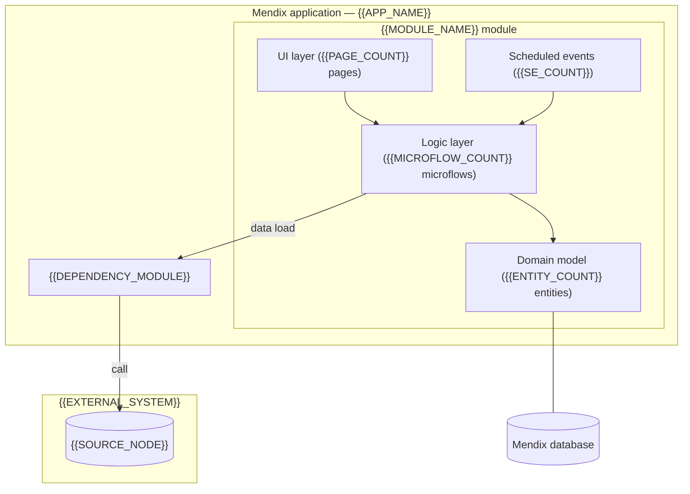

# Architecture (ARCH) — {{MODULE_NAME}} Module

A concise technical summary: the main building blocks and internal/external connection points{{DATA_CHAIN_NOTE}}.

> **Highlighting key:** 🟡 = assumption / to be confirmed · 🔴 = needs changing / open issue.

## Version history

<!-- guidance: auto-maintained by the track-doc-versions skill from the model diff. Newest row last. Re-run the generator rather than hand-editing. -->

| Version | Date | Author | Description |
|---------|------|--------|-------------|
| 1.0 | {{DATE}} | {{AUTHOR}} | Initial release. |

## 1. Overview

<!-- guidance: 1–2 paragraphs. What the module implements, what it stores vs. loads, and the high-level data flow. -->

{{OVERVIEW}}

It follows the classic Mendix three-tier structure (**UI → microflow logic → domain model**){{EXTRA_TIERS_NOTE}}.

## 2. Main building blocks

| Building block | Implementation |
|----------------|----------------|
| UI layer | {{PAGE_COUNT}} pages |
| Logic layer | {{MICROFLOW_COUNT}} microflows ({{MICROFLOW_PREFIXES}}) |
| Domain model | {{ENTITY_COUNT}} entities |
| Scheduled events | {{SE_COUNT}} scheduled events |
| Integration | {{INTEGRATION_SUMMARY}} |
| Logging | `{{LOG_NODE}}` log node |

**Domain model groups (entities):**
- *{{ENTITY_GROUP_1}}:* {{ENTITY_GROUP_1_MEMBERS}}
- *{{ENTITY_GROUP_2}}:* {{ENTITY_GROUP_2_MEMBERS}}

**Associations and delete behavior:**

| Association | Type / owner | Delete |
|-------------|--------------|--------|
| {{ASSOC_1}} | {{ASSOC_1_TYPE}} | {{ASSOC_1_DELETE}} |
| {{ASSOC_2}} | {{ASSOC_2_TYPE}} | {{ASSOC_2_DELETE}} |

## 3. Microflow inventory by role ({{MICROFLOW_COUNT}} total)

| Prefix | Role | Examples |
|--------|------|----------|
| `ACT_` | User/action flow | {{ACT_EXAMPLES}} |
| `SUB_` | Sub-process | {{SUB_EXAMPLES}} |
| `DS_` | Data source | {{DS_EXAMPLES}} |
| `NAV_` | Navigation | {{NAV_EXAMPLES}} |
| `SE_` | Scheduled-event logic | {{SE_EXAMPLES}} |

## 4. Architecture diagram

<!-- guidance: adapt the flowchart to the module. Keep external systems and the Mendix app as subgraphs; show the data flow with labelled arrows. -->

## 5. Internal connection points (between modules)

| Module | Role |
|--------|------|
| **{{INTERNAL_MODULE_1}}** | {{INTERNAL_MODULE_1_ROLE}} |
| **{{INTERNAL_MODULE_2}}** | {{INTERNAL_MODULE_2_ROLE}} |

## 6. External connection points

| External point | Notes |
|----------------|-------|
| {{EXTERNAL_POINT_1}} | {{EXTERNAL_POINT_1_NOTE}} |
| {{EXTERNAL_POINT_2}} | 🟡 {{EXTERNAL_POINT_2_ASSUMED_NOTE}} |

## 6.1 Processing strategy

<!-- guidance: describe notable processing patterns: batching, transactions, deduplication, async/task queue, file generation. Remove if not relevant. -->

- {{PROCESSING_NOTE_1}}
- {{PROCESSING_NOTE_2}}

## 7. Technology stack and quality notes

- **Platform:** Mendix (low-code), {{HOSTING}}.
- **Integration:** {{INTEGRATION_TECH}}.
- 🔴 **Watch-outs:** {{TECH_DEBT_NOTES}}
