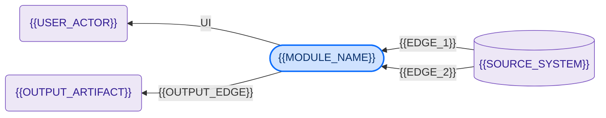

# {{MODULE_NAME}} — Developer and Support Documentation

The purpose of this document is to describe in detail the structure, operation and technical
solutions of the {{MODULE_NAME}} module, and to help understand the code, fix issues, operate and
support it.

## Version history

<!-- guidance: auto-maintained by the track-doc-versions skill from the model diff. Newest row last. Re-run the generator rather than hand-editing. -->

| Version | Date | Author | Description |
|---------|------|--------|-------------|
| 1.0 | {{DATE}} | {{AUTHOR}} | Initial release — developer and support documentation for the {{MODULE_NAME}} module. |

> **Highlighting key:** 🟡 = assumption / to be confirmed · 🔴 = needs changing / open issue.

## Table of contents

<!-- guidance: keep this as a nested bullet list with literal section numbers; ordered lists with sub-items render poorly in markdown. -->

- **1. Introduction**
  - 1.1. Glossary
  - 1.2. Installation and configuration
  - 1.3. Environments
- **2. Application context**
  - 2.1. Channels
  - 2.2. Permissions
- **3. Functions**
  - 3.1. {{FUNCTION_1}}
  - 3.2. {{FUNCTION_2}}
  - 3.3. Scheduled events
  - 3.4. Logs
- **4. Data types**
  - 4.1. Basic data types
  - 4.2. Entities
  - 4.3. Enumerations
- **5. Support and operations**
  - 5.1. Monitoring and logging
  - 5.2. Common incidents and their resolution
  - 5.3. Operational tasks
  - 5.4. Escalation and dependencies
  - 5.5. Known risks and open points
  - 5.6. Migration and parallel operation
- **6. Used modules and components**

---

## 1. Introduction

{{INTRODUCTION}}

### 1.1. Glossary

| Term | Explanation |
|------|-------------|
| {{TERM_1}} | {{TERM_1_EXPLANATION}} |
| {{TERM_2}} | {{TERM_2_EXPLANATION}} |

### 1.2. Installation and configuration

The application (`{{APP_NAME}}`) is available and can be cloned at: `{{GIT_REPO_URL}}`.

Installation requires **Mendix {{MENDIX_VERSION}}**. Model settings: AfterStartup =
`{{AFTER_STARTUP_MICROFLOW}}`, password hash = {{HASH_ALGORITHM}}, Java = {{JAVA_VERSION}}.

{{MODULE_CONSTANTS_NOTE}}

### 1.3. Environments

- Test: `{{TEST_URL}}`
- Production: `{{PROD_URL}}`

Sign-in is via **{{AUTH_METHOD}}**, provided the user has the necessary rights. {{ENV_NOTE}}

## 2. Application context

<!-- guidance: 1 short paragraph, then a hub-and-spoke mermaid diagram. Adapt nodes/edges; keep the classDef colours so the app node is highlighted. -->

{{CONTEXT_DESCRIPTION}}

### 2.1. Channels

<!-- guidance: describe each channel WITH its direction — inbound integrations AND outbound channels
     (generated outputs: PDFs/exports/files, emails, data pushed to other systems), plus connector,
     operations, and any upstream data preparation. Do not list only inbound sources — the module's
     generated artifacts (e.g. a produced PDF) are outbound channels and belong here too. -->

- **{{CHANNEL_1}}:** {{CHANNEL_1_DESCRIPTION}}
- **{{CHANNEL_2}}:** {{CHANNEL_2_DESCRIPTION}}

### 2.2. Permissions

The module has {{ROLE_COUNT}} module roles. {{USER_ROLE_CONVENTION_NOTE}}

- **{{ROLE_1}}** (module role) — {{ROLE_1_DESCRIPTION}} User role: `{{USER_ROLE_1}}`.
- **{{ROLE_2}}** (module role) — {{ROLE_2_DESCRIPTION}} User role(s): `{{USER_ROLE_2}}`.

## 3. Functions

The functions follow the pages reached from the **"{{MENU_GROUP}}"** navigation menu group.

<!-- guidance: one subsection per PAGE — include a subsection for EVERY page in the module's
     navigation menu group(s). Cross-check `SHOW NAVIGATION MENU` against `SHOW PAGES` so no page is
     omitted, and explicitly cover Administrator-only pages (interface/staging data, master-data admin):
     each such page gets its OWN numbered subsection (3.3, 3.4, …) with its OWN access matrix — do not
     merge several pages into one subsection. Renumber Scheduled events / Logs after however many page
     subsections there are.
     Each subsection gets a description, an access matrix, and a SCREENSHOT of the page (overview +
     edit/detail dialogs), plus samples of useful artifacts (generated documents/PDFs, key filters,
     error states). Use marked placeholders 🖼️ / 📄 until real captures are added.
     Access matrix: granted = ✅ ; not granted = – . Markdown table (no HTML — Confluence escapes it). -->

### 3.1. {{FUNCTION_1}}

{{FUNCTION_1_DESCRIPTION}}

| Function | {{ROLE_1}} | {{ROLE_2}} |
|----------|:---:|:---:|
| {{ACTION_1}} | ✅ | ✅ |
| {{ACTION_2}} | ✅ | – |

> 🖼️ **[Screenshot: {{FUNCTION_1}} — overview page]**
> 🖼️ **[Screenshot: {{FUNCTION_1}} — edit/detail dialog]**

### 3.2. {{FUNCTION_2}}

{{FUNCTION_2_DESCRIPTION}}

| Function | {{ROLE_1}} | {{ROLE_2}} |
|----------|:---:|:---:|
| {{ACTION_1}} | ✅ | ✅ |
| {{ACTION_2}} | ✅ | – |

> 🖼️ **[Screenshot: {{FUNCTION_2}} — page]**
> 📄 **[Sample: {{FUNCTION_2}} — generated artifact, if any (e.g. exported document/PDF)]**

### 3.3. Scheduled events

The module has {{SE_COUNT}} scheduled events. The exact interval is configured in the Mendix Cloud
Portal; the frequency below follows from the nature of each process.

| Scheduled event | Function | Frequency |
|-----------------|----------|-----------|
| `{{SE_1}}` | {{SE_1_FUNCTION}} | {{SE_1_FREQUENCY}} |
| `{{SE_2}}` | {{SE_2_FUNCTION}} | 🟡 {{SE_2_FREQUENCY_ASSUMED}} |

### 3.4. Logs

The module writes to the `{{LOG_NODE}}` log node on the main operations. Typical messages:
{{LOG_MESSAGES}}

## 4. Data types

### 4.1. Basic data types

- Text (String)
- Number (Long / Integer / Decimal)
- Date (DateTime)
- Boolean
- Enumeration

### 4.2. Entities

The module consists of {{ENTITY_COUNT}} entities ({{PERSISTENT_COUNT}} persistent,
{{NONPERSISTENT_COUNT}} non-persistent). One table per entity, listing all of its attributes.

<!-- guidance: give EVERY entity (business, staging, AND non-persistent helpers) its OWN attribute
     table — never summarize, merge attributes into one row, or omit an entity; run DESCRIBE ENTITY
     for all of them and list every attribute on its own row. Put the entity's type + indexes + event
     handlers in the bold header line above its table. Escape a leading underscore in an attribute
     name as \_Name so markdown does not italicize it. -->

**{{ENTITY_1}}** — {{ENTITY_1_DESCRIPTION}}; {{ENTITY_1_TYPE_INDEX_EVENT}}.

| Attribute | Type | Description |
|-----------|------|-------------|
| {{ATTR_1}} | {{ATTR_1_TYPE}} | {{ATTR_1_DESCRIPTION}} |
| {{ATTR_2}} | {{ATTR_2_TYPE}} | {{ATTR_2_DESCRIPTION}} |

**{{ENTITY_2}}** — {{ENTITY_2_DESCRIPTION}}; {{ENTITY_2_TYPE_INDEX_EVENT}}.

| Attribute | Type | Description |
|-----------|------|-------------|
| {{ATTR_1}} | {{ATTR_1_TYPE}} | {{ATTR_1_DESCRIPTION}} |

### 4.3. Enumerations

| ENUM | Values |
|------|--------|
| {{ENUM_1}} | {{ENUM_1_VALUES}} |
| {{ENUM_2}} | {{ENUM_2_VALUES}} |

## 5. Support and operations

### 5.1. Monitoring and logging

- **Log node:** `{{LOG_NODE}}`. Filter on it to follow the module's operation.
- **What to watch:** {{MONITORING_NOTE}}

### 5.2. Common incidents and their resolution

| Symptom | Probable cause | Action |
|---------|----------------|--------|
| {{SYMPTOM_1}} | {{CAUSE_1}} | {{ACTION_1}} |
| {{SYMPTOM_2}} | {{CAUSE_2}} | {{ACTION_2}} |

### 5.3. Operational tasks

- {{OPERATIONAL_TASK_1}}
- {{OPERATIONAL_TASK_2}}

### 5.4. Escalation and dependencies

| Dependency | Role | Escalation |
|------------|------|------------|
| {{DEPENDENCY_1}} | {{DEPENDENCY_1_ROLE}} | {{DEPENDENCY_1_ESCALATION}} |
| {{DEPENDENCY_2}} | {{DEPENDENCY_2_ROLE}} | {{DEPENDENCY_2_ESCALATION}} |

### 5.5. Known risks and open points

- 🔴 **{{RISK_1_TITLE}} (open):** {{RISK_1_DESCRIPTION}}
- 🔴 **Technical debt:** {{TECH_DEBT_DESCRIPTION}}
- 🟡 **Planned extension:** {{PLANNED_EXTENSION}}

### 5.6. Migration and parallel operation

<!-- guidance: remove if the module is not a replacement for a legacy system. -->

{{MIGRATION_NOTE}}

## 6. Used modules and components

The application also uses the modules common to every application; their operation is not detailed
here. The modules actually called by {{MODULE_NAME}}:

| Module | Type / version | Role |
|--------|----------------|------|
| **{{MODULE_NAME}}** | own business module | The module's business logic (the subject of this document) |
| **{{DEP_MODULE_1}}** | {{DEP_MODULE_1_TYPE}} | {{DEP_MODULE_1_ROLE}} |
| **{{DEP_MODULE_2}}** | {{DEP_MODULE_2_TYPE}} | {{DEP_MODULE_2_ROLE}} |
